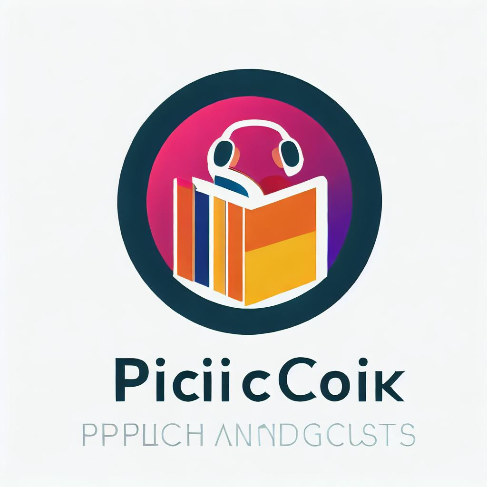
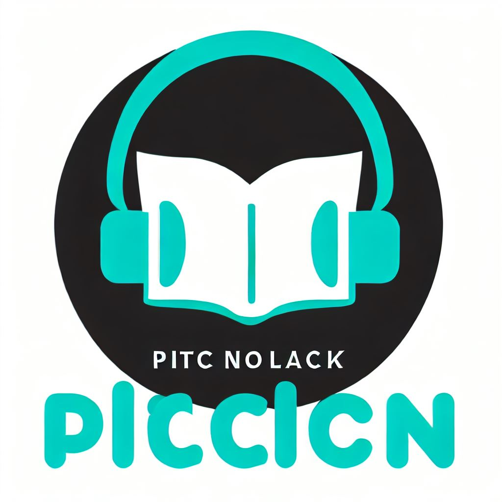

# Artwork for PictoTale

## Create application Logo

### 1. Create a logo suggestion

Used BING Image Creator (DALL-E):
```
Logo "PictoTale" höre und schaue dein ebook
```

Results:





### 2. Build Image files from suggestion

- Resize image
- Create transparent background
- Add application title
- Build different versions

==> All this was done manually with GIMP

Results:


### 3. Generate favigon from logo.png

used [favicon.io - FAVICON Generator](https://favicon.io/)

Result:


## Tool suggestions

### Create transparency with GIMP

* Menü: Datei/Als Ebenen öffnen --> JPG Datei (o.Ä.) auswählen
* Menü: Ebenen/Transparenz/Alpha-Kanal hinzufügen
* Zauberstab Werkzeug auswählen und zum Markieren verwenden
* \[Entf\] drücken um transparenten Hintergrund zu erzeugen
* Menü: Datei/Exportieren als --> Datei mit Endung .PNG angeben

see [Wondershare: How to Make White Background Transparent in GIMP?](https://pixcut.wondershare.com/blog/how-to-make-white-background-transparent-in-gimp.html)

### Create favicon.ico

Online Tool: [favicon.io - FAVICON Generator](https://favicon.io/)